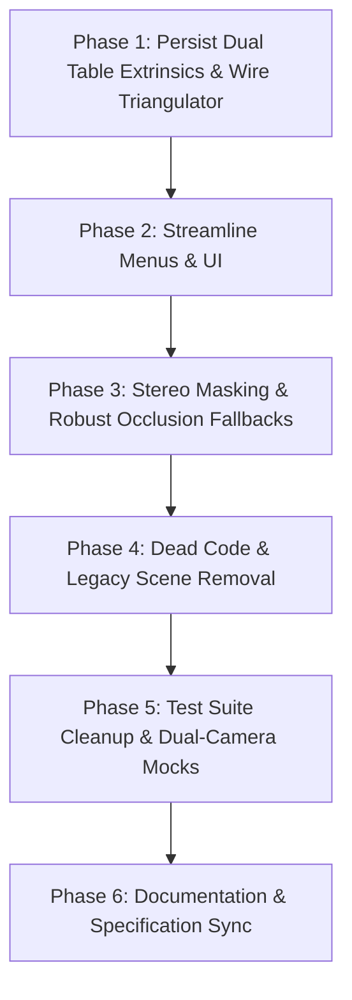

# Stereo Vision Default Simplification Plan (v2 - Mathematically & Architecturally Verified)

This plan establishes **dual-camera stereo vision as the default standard** for Light Map. It resolves all mathematical, geometric, and fallback edge cases, establishing clean architecture without legacy debt.

______________________________________________________________________

## 1. Core Architectural Decisions

1. **Tabletop World Coordinate System ($Z=0$):**

   - The origin $(0, 0, 0)$ and plane $Z=0$ are defined by the physical tabletop.
   - Both cameras have rigid table-relative extrinsics:
     - Camera Left: $[R_L \\mid t_L]$ (mapping World to Left Camera: $P_L = R_L \\cdot P_W + t_L$)
     - Camera Right: $[R_R \\mid t_R]$ (mapping World to Right Camera: $P_R = R_R \\cdot P_W + t_R$)
   - `StereoTriangulator` uses projection matrices:
     $$P\_{\\text{proj}, L} = K_L [R_L \\mid t_L], \\quad P\_{\\text{proj}, R} = K_R [R_R \\mid t_R]$$
     This guarantees all triangulated points emerge directly in tabletop physical millimeter coordinates $(X_W, Y_W, Z_W)$ where $Z = 0$ is the tabletop.

1. **Occlusion Fallback Architecture (The Role of Token Heights):**

   - **Stereo Match (Primary):** When visible in both cameras, true $(X, Y, Z\_{\\text{mm}})$ is triangulated dynamically.
   - **Single-Camera Fallback (Occlusion Recovery):** If one camera is occluded (by a player's arm, physical terrain, or token edge):
     - **Tokens:** The system intersects the unoccluded camera ray with the horizontal plane $Z = h\_{\\text{token}}$ fetched from `tokens.json`. **Configured token heights are strictly retained as the ground-truth occlusion fallback.**
     - **Hands:** The system intersects the single-camera ray with the horizontal plane $Z = Z\_{\\text{last_known}}$ (the last triangulated elevation of that hand).

1. **Projector Model & Parallax Geometry:**

   - **Tabletop Mapping ($Z=0$):** Maps and on-table graphics are projected using the 2D table homography $H$ solved in Phase 1 of stereo calibration.
   - **Parallax Masking ($Z>0$):** For objects at elevation $Z > 0$, the projector ray from optical center $C\_{\\text{proj}} = (X_p, Y_p, Z_p)$ through physical point $P(X, Y, Z)$ hits the tabletop at:
     $$P\_{\\text{table}} = P + (P - C\_{\\text{proj}}) \\cdot \\left(\\frac{-P_z}{P_z - Z_p}\\right)$$
     The 2D table homography $H$ then maps $P\_{\\text{table}}$ to projector pixels.
   - **Projector Center $C\_{\\text{proj}}$ Specification:** Since tabletop gaming projectors are mounted overhead facing the table, $C\_{\\text{proj}}$ is parameterized as nominal overhead coordinates: $[X\_{\\text{table_center}}, Y\_{\\text{table_center}}, Z\_{\\text{mount}}]$ (default $Z\_{\\text{mount}} \\approx 1200,\\text{mm}$, adjustable in global config). This completely eliminates the need for the physical box target and `Projector3DCalibrationScene`.

1. **Mask Layer Geometries:**

   - **ArUco Masks:** Because ArUco detections produce 4 ordered corners (top-left, top-right, bottom-right, bottom-left) in both camera views, `StereoTriangulator` will triangulate the 4 corners in 3D $(X_i, Y_i, Z_i)$ when stereo-matched (or project the 4 ray-plane intersections during fallback). The mask polygon is formed from these 4 corners.
   - **Hand Masks:** Contours are continuous 2D hulls, not discrete point pairs. The system triangulates the hand landmark/centroid 3D elevation ($Z\_{\\text{hand}}$) in real time. The 2D hull from the primary camera is then projected using ray-plane intersection at $Z = Z\_{\\text{hand}}$, completely replacing the hardcoded $20,\\text{mm}$ assumption without computationally infeasible dense disparity mapping.

1. **Architectural Invariants (`AGENTS.md`):**

   - **Read/Write Separation:** State updates from the triangulator flow exclusively through `EnvironmentManager` / `PersistenceService` to update `WorldState`.
   - **Monotonic Timestamp Versioning:** When publishing new token or hand positions, `tokens_version`, `raw_aruco_version`, and `hands_version` are updated using `time.monotonic_ns()` (never incremented counters).
   - **Typed Config Sync:** Run `python3 scripts/generate_ts_schema.py` after any schema edits.

______________________________________________________________________

## 2. Phased Roadmap

______________________________________________________________________

### Phase 1: Persist Dual Table Extrinsics & Wire Triangulator

Ensure full table-relative extrinsics for both cameras are persisted and used to initialize the runtime triangulator.

1. **Update `CalibrationResult` (\[`models.py`\](file:///home/rchandia/mech-city/light_map/src/light_map/calibration/models.py)):**
   - Add fields:
     - `r_world_to_l`: Rotation vector/matrix for World $\\to$ Left Camera.
     - `t_world_to_l`: Translation vector for World $\\to$ Left Camera.
     - `r_world_to_r`: Rotation vector/matrix for World $\\to$ Right Camera.
     - `t_world_to_r`: Translation vector for World $\\to$ Right Camera.
1. **Update `SequentialSolver` (\[`solver.py`\](file:///home/rchandia/mech-city/light_map/src/light_map/core/calibration/solver.py)):**
   - Export the computed `r_world_to_l`, `t_world_to_l`, `r_world_to_r`, and `t_world_to_r` (already computed during ROI phase) directly into `CalibrationResult`.
   - Persist these into `stereo_calibration.json`.
1. **Initialize `StereoTriangulator` at Startup (\[`interactive_app.py`\](file:///home/rchandia/mech-city/light_map/src/light_map/interactive_app.py)):**
   - Construct `StereoTriangulator` using the saved table-relative extrinsics ($R_L, t_L, R_R, t_R$) and intrinsics from `stereo_calibration.json`.
   - Ensure coordinate output is in physical millimeters relative to the table surface ($Z=0$).
1. **Standardize Projector Center $C\_{\\text{proj}}$:**
   - Configure nominal overhead projector position $C\_{\\text{proj}} = (0, 0, Z\_{\\text{mount}})$ with $Z\_{\\text{mount}}$ defaulting to $1200,\\text{mm}$ in `AppConfig`.

______________________________________________________________________

### Phase 2: Streamline Menus & User Interface

Collapse the scattered calibration options into a unified, user-friendly flow.

1. **Projector In-Game Menu (\[`menu_builder.py`\](file:///home/rchandia/mech-city/light_map/src/light_map/menu/menu_builder.py)):**
   - Replace the numbered list (1 to 6) under `Calibration` with a single entry: **"Calibrate Table"** (launches `StereoCalibrationScene`).
   - Move `Set Scale` strictly under `Map Settings`.
   - Deprecate `Calibrate Flash` and `Scan Algorithm` switcher from the `Session` menu.
1. **Web Control Dashboard (\[`CalibrationWizard.tsx`\](file:///home/rchandia/mech-city/light_map/frontend/src/components/CalibrationWizard.tsx)):**
   - Prominently display a single primary action: **"Run Table Calibration"**.
   - Display side-by-side live video previews for Camera Left and Camera Right.
   - Relegate single-camera/lens intrinsics routines into an expandable "Advanced / Hardware Maintenance" drawer or hide when stereo is enabled.

______________________________________________________________________

### Phase 3: Stereo Masking & Robust Occlusion Fallbacks

Migrate projection masking to true 3D spatial points with guaranteed single-camera occlusion fallbacks.

1. **Four-Corner ArUco Triangulation & Masking (\[`aruco_mask_layer.py`\](file:///home/rchandia/mech-city/light_map/src/light_map/rendering/layers/aruco_mask_layer.py)):**
   - When visible in both cameras: Triangulate the 4 marker corner points $(X_i, Y_i, Z_i)$ directly.
   - When occluded in one camera (fallback): Use single-camera ray-plane intersection with $Z = h\_{\\text{token}}$ from `tokens.json` to calculate the 4 corner points.
   - Project the 4 corner points along the ray from $C\_{\\text{proj}}$ to tabletop $Z=0$, then apply homography $H$ to get projector mask pixels.
1. **Hand Mask Elevation & Contour Projection (\[`hand_mask_layer.py`\](file:///home/rchandia/mech-city/light_map/src/light_map/rendering/layers/hand_mask_layer.py)):**
   - Triangulate hand landmarks to measure real elevation $Z\_{\\text{hand}}$ (or use $Z\_{\\text{last_known}}$ on single-camera fallback).
   - Project the 2D contour hull from the primary camera using ray-plane intersection at $Z = Z\_{\\text{hand}}$.
   - Apply projector parallax factor to map the mask to projector space, completely removing the hardcoded $20,\\text{mm}$ assumption.
1. **WorldState Updates:**
   - Ensure `WorldState` updates for tokens and hands are made via managers and versioned with `time.monotonic_ns()`.

______________________________________________________________________

### Phase 4: Dead Code & Legacy Scene Removal

Clean out obsolete scenes, solvers, and unused configuration keys.

1. **Deprecate Legacy Calibration Scenes in \[`calibration_scenes.py`\](file:///home/rchandia/mech-city/light_map/src/light_map/calibration/calibration_scenes.py):**
   - Remove or archive:
     - `ProjectorCalibrationScene` (Option 2)
     - `PpiCalibrationScene` (Option 3)
     - `ExtrinsicsCalibrationScene` (Option 4)
     - `Projector3DCalibrationScene` (Option 5)
     - `FlashCalibrationScene` (Option 7)
1. **Retire Legacy Data Files:**
   - Deprecate `camera_extrinsics.npz` and `projector_3d_calibration.npz`.
   - Retain `camera_calibration.npz` strictly as a fallback lens intrinsics profile.
1. **Configuration Schema Scrub (\[`config_schema.py`\](file:///home/rchandia/mech-city/light_map/src/light_map/core/config_schema.py)):**
   - Set `stereo_vision.enable_stereo = True` by default.
   - Deprecate `flash_intensity`, `detection_algorithm`, and monocular projector position overrides.
   - Run `scripts/generate_ts_schema.py` to keep frontend types synchronized.

______________________________________________________________________

### Phase 5: Test Suite Cleanup & Dual-Camera Mocks

Ensure the test suite reflects the stereo-default architecture without brittle legacy dependencies.

1. **Retire Stale Calibration Scene Tests:**
   - Remove or archive unit tests for deleted legacy scenes:
     - `tests/test_extrinsics_calibration_scene.py`
     - `tests/test_ppi_calibration_scene.py`
     - `tests/test_projector_calibration_scene.py`
     - `tests/test_projector_3d_calibration_scene.py`
     - `tests/test_flash_calibration_scene.py`
1. **Update Common Fixtures & Mocks:**
   - Update camera test fixtures to provide dual-camera mocks (`MockMultiCameraManager`, Left & Right streams) rather than single-camera instances.
   - Ensure tests instantiating `TrackingCoordinator`, `TokenTracker`, or mask layers use stereo triangulation fixtures.
1. **Stereo Pipeline & Fallback Test Coverage:**
   - Expand `tests/test_stereo_calibration.py` and `tests/test_stereo_triangulator.py` to cover:
     - Dual table-relative extrinsics persistence.
     - Dual-camera 4-corner triangulation.
     - Single-camera occlusion fallback with $h\_{\\text{token}}$ and $Z\_{\\text{last_known}}$.
     - Monotonic timestamp validation.
   - Maintain the required **$\\ge 80%$** code coverage threshold (`pytest --cov=src`).

______________________________________________________________________

### Phase 6: Documentation & Data Alignment

Synchronize all project documentation, specifications, and data files without disrupting game session data.

1. **Preserve `tokens.json` Game Configuration:**
   - **Do not remove** token names, colors, sizes, types, or profile definitions used during gameplay.
   - Retain token heights as ground-truth for calibration reference tokens (IDs 0–3) and single-camera occlusion fallback.
   - Strictly enforce ArUco ID partitioning: reserve IDs `40–49` for system targets (`40–41` for PPI ruler, `42–49` for projected tabletop grid) while keeping user game tokens in IDs `0–39`.
1. **Update User & System Documentation:**
   - \[`docs/calibration.md`\](file:///home/rchandia/mech-city/light_map/docs/calibration.md): Rewrite to present the **Single-Sweep Table Calibration** as the standard setup procedure, detailing the target sheet (IDs 40 & 41) and the 4 reference PC tokens (IDs 0–3).
   - \[`docs/configuration.md`\](file:///home/rchandia/mech-city/light_map/docs/configuration.md): Document `stereo_calibration.json`, dual-camera settings, and removal of legacy monocular options.
   - \[`docs/architecture.md`\](file:///home/rchandia/mech-city/light_map/docs/architecture.md): Document the stereo triangulation pipeline, shared memory ring buffers, 3D coordinate schema, and occlusion fallback mechanics.
1. **Scrub Feature Specifications (`features/`):**
   - Move completed or obsolete monocular designs to `docs/plans/archive/`.
   - Update \[`features/subdesigns/stereo_cleanup_and_refactoring.md`\](file:///home/rchandia/mech-city/light_map/features/subdesigns/stereo_cleanup_and_refactoring.md) and \[`features/stereo_vision_support.md`\](file:///home/rchandia/mech-city/light_map/features/stereo_vision_support.md) to record the transition to stereo default.
